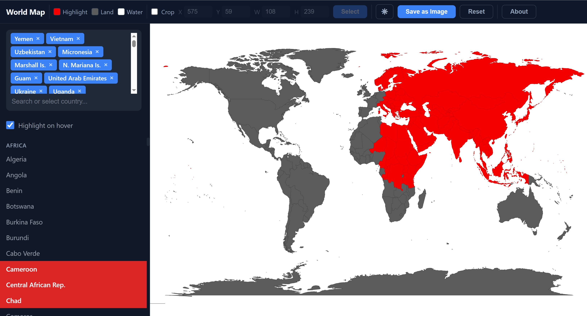
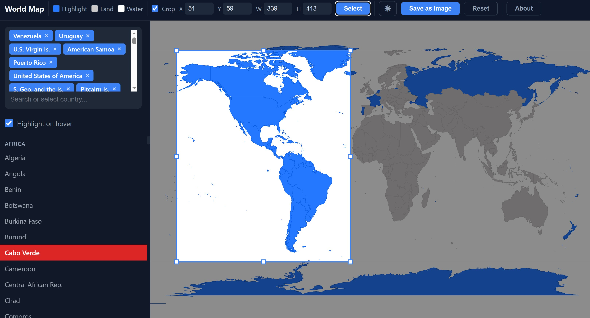

# World Map Explorer

An interactive world map application built with HTML Canvas and TopoJSON. Browse, search, highlight, and export countries with a customizable interface.

## Features

- **Interactive Map** — Hover to highlight countries, click to select/deselect
- **Tag-Based Selection** — Selected countries appear as tags with an × to remove
- **Search & Filter** — Filter countries by name with continent-grouped results
- **Crop & Export** — Define a crop region with drag/resize handles, then export as PNG
- **Select by Crop** — Select all countries within the crop rectangle in one click
- **Customizable Colors** — Change water, land, and highlight colors via the toolbar
- **Dark/Light Theme** — Toggle between dark and light mode
- **Persistent State** — Selections, colors, and crop settings persist across sessions

## Usage

1. Open `index.html` in a browser
2. **Hover** over any country to highlight it
3. **Click** a country to select it — it appears as a tag in the sidebar
4. **Search** countries by name in the tag input field
5. Enable **Crop** to define an export region — drag the selection or type X/Y/W/H
6. Click **Select** (when crop is active) to select all intersecting countries
7. Click **Save as Image** to export the map view or cropped region
8. Toggle **☀/☾** to switch themes

## Screenshots

## Technical Details

- Pure client-side — no server required
- Uses [TopoJSON](https://github.com/topojson/topojson-client) for country boundary data
- Countries rendered on an HTML Canvas element with DPR-aware resolution
- State saved to `localStorage`

## Credits

Frozenology and
Created by **Kobchaipuk Kemapirom**  
[imp.metropolian@gmail.com](mailto:imp.metropolian@gmail.com)

## License

GNU General Public License v3.0 — see [LICENSE](LICENSE) for details.
